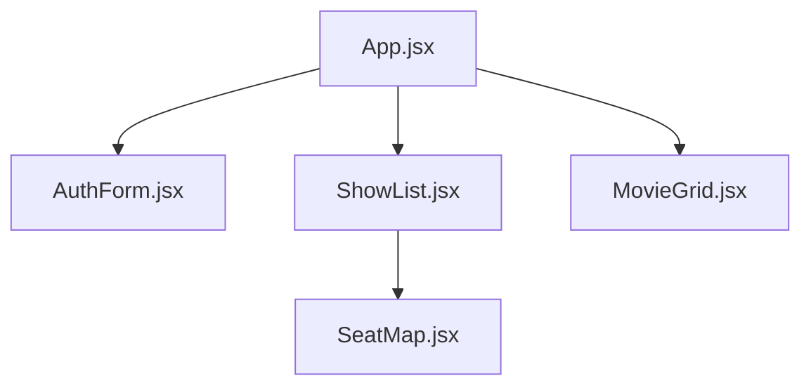

# Movie Booking UI: System Documentation

## 1. Introduction
The Movie Booking UI is a decoupled client-side application built in React. It consumes the Movie Booking API to provide a seamless, multi-step booking flow for users, from movie selection to seat booking.

## 2. System Architecture
This diagram shows the frontend's relationship with the user and the backend API.

```mermaid
graph TD
    User[User] --> Browser[Browser]

    subgraph "Vercel Cloud Platform"
        Browser --> React[React UI (Vite)]
    end

    subgraph "Render Cloud Platform"
        API[Movie Booking API]
    end

    React -->|API Calls (Axios)| API
    API -->|Responds (JSON)| React
    React -->|Renders HTML/CSS| Browser
```

## 3. Tech Stack & Key Libraries

| Library | Category | Purpose |
| :--- | :--- | :--- |
| **React** | Framework | For building the component-based user interface. |
| **Vite** | Build Tool | For a fast, modern development environment and build process. |
| **`axios`** | Networking | HTTP client for making requests to the backend API. |
| **`useAuth` (custom)** | State Management | Custom hook to manage user state and JWT in `localStorage`. |
| **`api.js` (custom)** | Networking | Centralized `axios` instance that auto-injects the `Authorization` header. |

## 4. Component Hierarchy



## 5. State Management

State is managed locally within components using `useState`. Global user state (authentication) is managed by a custom hook, `useAuth`, which syncs the user's data and JWT with `localStorage` for session persistence.

## 6. Key Features

- **Auth:** Full user sign-up and login flow.  
- **Persistent Session:** User stays logged in on refresh.  
- **Movie Selection:** (Step 1) Fetches and displays a grid of all movies.  
- **Showtime Selection:** (Step 2) Fetches and displays all showtimes for a selected movie.  
- **Seat Map:** (Step 3) Renders an interactive seat map for a selected show.  
- **Visual Booking Status:** Differentiates between `available` seats, `booked` (by others) seats, and `mine` (booked by you) seats.  
- **Authenticated Booking:** Submits a booking request using the user's JWT and a unique idempotency key.
