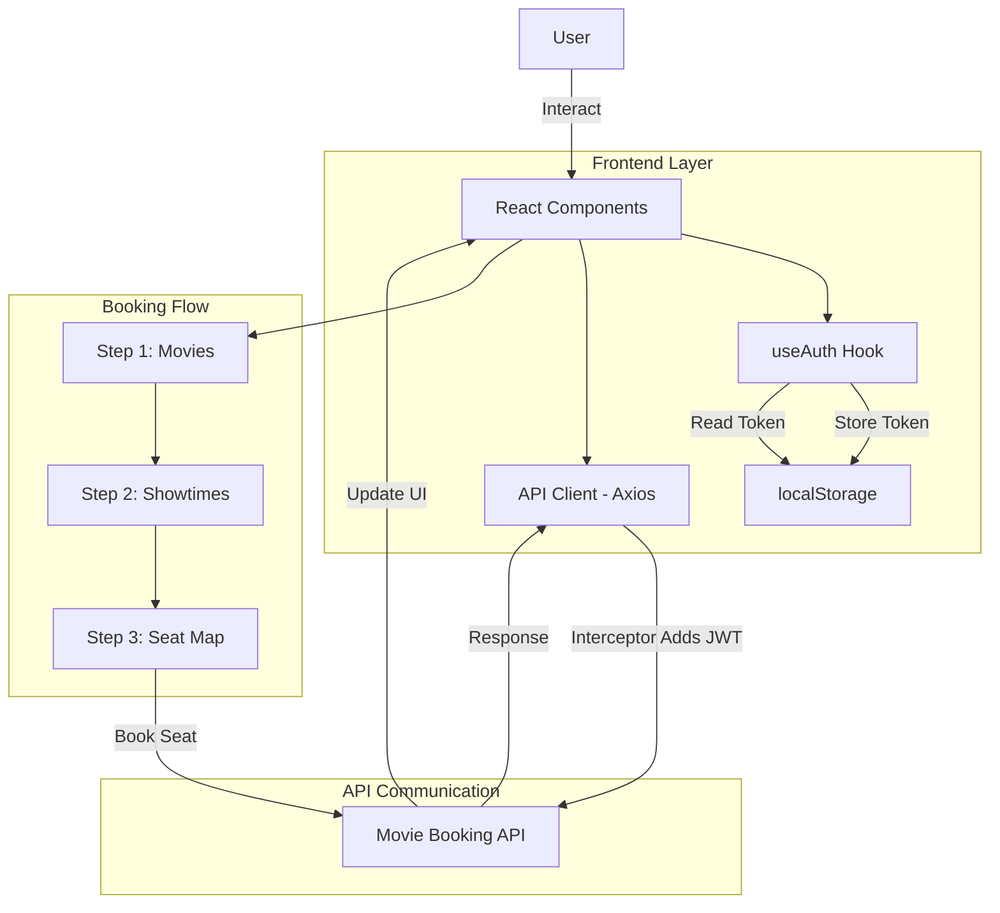

# 🎬 Movie Booking UI (React)


A modern, responsive frontend for a movie ticket booking system built with **React** and **Vite**. Provides a seamless 3-step booking flow with JWT authentication, fully integrated with the production [Movie Booking API](https://github.com/your-username/movie-booking-api).

---

## 🏗️ System Architecture

The application follows a component-based architecture with centralized state management and API communication.

### High-Level Design
1. **Authentication Layer:** JWT-based auth with persistent sessions using localStorage.
2. **Booking Flow:** Three-step user journey (Movies → Showtimes → Seats).
3. **API Integration:** Axios interceptors automatically inject auth tokens into protected requests.
4. **State Management:** Custom React hooks manage global auth state and local component state.



---

## ⚡ User Experience & Features

The application is designed for speed, responsiveness, and intuitive navigation through the booking process.

### 🎯 Booking Flow

* **Step 1 - Movie Selection:** Responsive grid layout showcasing "Now Playing" movies with posters and metadata.
* **Step 2 - Showtime Selection:** Dynamic list of available showtimes for the selected movie across different theaters.
* **Step 3 - Interactive Seat Map:** Visual seat grid with real-time status:
  - 🟢 **Available:** Seats you can book
  - 🔴 **Booked:** Already reserved by other users
  - 🔵 **Mine:** Your confirmed bookings

### 🔐 Authentication & Sessions

* **Persistent Login:** JWT tokens stored in localStorage maintain sessions across browser restarts.
* **Protected Routes:** Automatic redirect to login for unauthenticated users attempting to book.
* **Auto-Logout:** Expired tokens trigger automatic logout with user notification.

---

## 🛠️ Key Features

### 1. 🚀 Performance & UX

* **Fast Development:** Vite's Hot Module Replacement (HMR) provides instant feedback during development.
* **Responsive Design:** Mobile-first approach ensures seamless experience across all device sizes.
* **Optimistic UI Updates:** Instant feedback on user actions before API confirmation.
* **Loading States:** Clear visual indicators during API calls (spinners, skeleton screens).

### 2. 🔌 API Integration

* **Centralized API Client:** Single `api.js` file manages all HTTP requests with consistent error handling.
* **Axios Interceptors:** Automatically attaches Authorization headers to protected endpoints.
* **Error Boundaries:** Graceful error handling with user-friendly error messages.
* **Request Retry Logic:** Automatic retry for failed requests due to network issues.

### 3. 🎨 Component Architecture

* **Reusable Components:** Modular design with components like `MovieCard`, `SeatMap`, `AuthForm`.
* **Custom Hooks:** `useAuth` hook encapsulates authentication logic and state.
* **Prop Validation:** Type checking with PropTypes for component props.
* **Separation of Concerns:** Clear separation between UI, logic, and API layers.

---

## 🔧 Tech Stack

* **Library:** React 18+
* **Build Tool:** Vite 5+
* **HTTP Client:** Axios
* **Routing:** React Router (if implemented)
* **State Management:** React Hooks + Context API
* **Styling:** CSS Modules / Styled Components / Tailwind CSS
* **Deployment:** Vercel / Netlify

---

## 🏃‍♂️ Quick Start (Local)

1. **Clone the repo**

   ```bash
   git clone https://github.com/your-username/movie-booking-ui.git
   cd movie-booking-ui
   ```

2. **Install Dependencies**

   ```bash
   npm install
   ```

3. **Configure API URL**

   Open `src/api.js` and update the API endpoint:
   
   ```javascript
   // For local development
   const API_URL = 'http://localhost:3000/api';
   
   // For production
   // const API_URL = 'https://movie-booking-api-3wep.onrender.com/api';
   ```

4. **Start Development Server**

   ```bash
   npm run dev
   ```

5. **Build for Production**

   ```bash
   npm run build
   npm run preview
   ```

---

## 📱 Application Flow

### User Journey

```
1. Landing Page
   ↓
2. Register/Login → JWT Token Stored
   ↓
3. Browse Movies → Select Movie
   ↓
4. View Showtimes → Select Show
   ↓
5. Interactive Seat Map → Select Seat
   ↓
6. Confirm Booking → Success/Error Feedback
   ↓
7. View Booking Confirmation
```

### API Endpoints Used

| Endpoint | Method | Purpose |
|:---|:---|:---|
| `/auth/register` | POST | User registration |
| `/auth/login` | POST | User authentication |
| `/movies` | GET | Fetch all movies |
| `/movies/:id/shows` | GET | Get showtimes for a movie |
| `/shows/:id/seats` | GET | Get seat availability |
| `/bookings` | POST | Book a seat (Protected) |

---

## 🔗 Live Demo

Access the production application here:  
**[https://movie-booking-ui.vercel.app/](https://movie-booking-ui.vercel.app/)**

For detailed technical documentation, see [**DOCUMENTATION.md**](DOCUMENTATION.md).

---

## 🚀 Future Scope & Improvements

* **Payment Integration:** Add Stripe/Razorpay checkout flow for seat payment before confirmation.
* **User Dashboard:** Dedicated page showing booking history, upcoming shows, and cancellation options.
* **Real-Time Updates:** WebSocket integration for live seat availability updates during selection.
* **Social Features:** Allow users to share movie recommendations and invite friends to book together.
* **PWA Support:** Convert to Progressive Web App for offline access and push notifications.
* **Accessibility:** Enhance ARIA labels, keyboard navigation, and screen reader support.
* **Dark Mode:** Add theme toggle for improved viewing experience in low-light conditions.
* **Multi-Language Support:** Implement i18n for international audiences.
